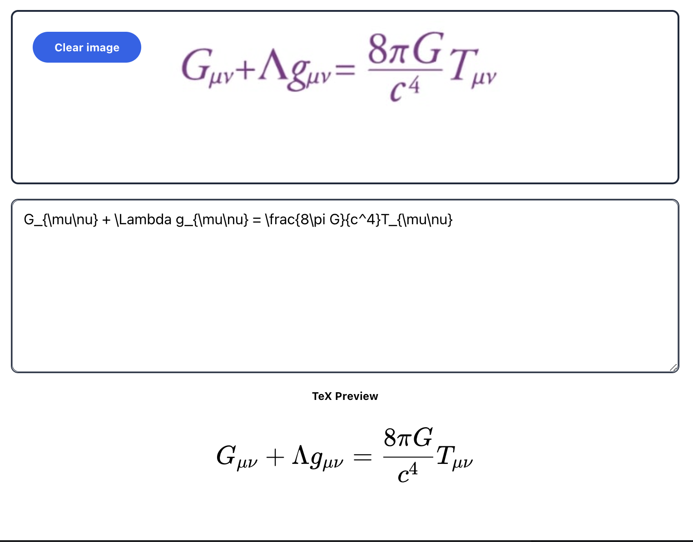

# img2math



## description

A chrome extension on converting images into TeX code that runs locally in the browser. The current model is an encoder-decoder ViT transformer about 50mb large quantized—the model does not actually work yet and is not connected to the extension.

## preview

```
yarn start
```

## build

```
yarn build
```

todo:

- debug why validation loss isn't going down
